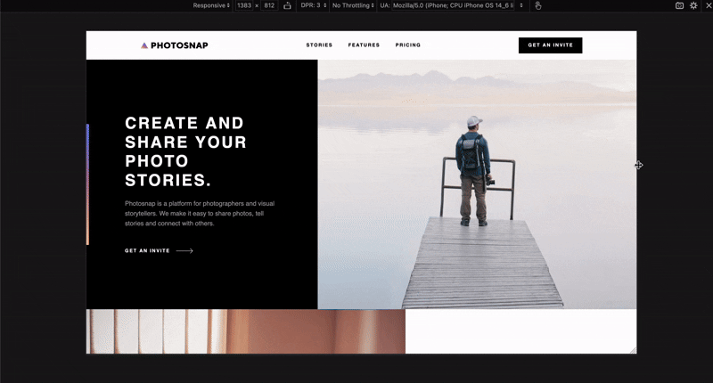

# 📸 Photosnap – multi-page marketing site

A pixel-perfect rebuild of the **Frontend Mentor "Photosnap" design** using **Vite + Tailwind CSS + Vanilla JS**.

[Live Demo](https://photosnap-thawit.netlify.app/) • [Design Brief](https://www.frontendmentor.io/challenges/photosnap-multipage-website-nMDSrNmNW)

---

## 🚀 Features

- **Multi-page setup** – 4 static HTML pages (Home, Stories, Features, Pricing) served by Vite
- Fully responsive ⚡ – looks great on mobile, tablet, and 4K screens
- 100/100 Lighthouse in Performance, Accessibility, Best Practices, SEO 💯
- Semantic HTML + ARIA for screen-reader friendliness
- Modern image formats with fallback (AVIF → WebP → JPEG)
- Reusable components & utility classes – clean, scalable code
- Smooth page transitions and animations
- Cross-browser compatible (Chrome, Firefox, Safari, Edge)
- Optimized performance with lazy loading and code splitting
- Mobile-first approach with progressive enhancement

## 🛠️ Tech Stack

| Tool               | Why it's used here                                                   |
| ------------------ | -------------------------------------------------------------------- |
| **Vite 4**         | Lightning-fast dev server and optimized production build             |
| **Tailwind CSS 4** | Utility-first styling with a custom theme for consistent breakpoints |
| **Vanilla JS**     | Lightweight interactivity without framework overhead                 |

## 📈 Lighthouse Report


## 🖥️ Screenshots

 

## 📁 Project Structure

```
photosnap/
├── src/
│   ├── css/          # Global styles and Tailwind config
│   └── js/           # JavaScript modules
├── public/           # Static assets (images, fonts)
├── scripts/          # Additional scripts
├── index.html        # Home page
├── stories.html      # Stories page
├── features.html     # Features page
├── pricing.html      # Pricing page
├── vite.config.js    # Vite configuration
└── package.json      # Project dependencies
``` 

## 🏗️ Getting Started

```bash
git clone https://github.com/youruser/photosnap.git
cd photosnap
npm i
npm run dev      # starts on http://localhost:5173
npm run build    # production build to /dist
```

## 📞 Contact

- **Portfolio**: [Your Portfolio URL]
- **Email**: [Your Professional Email]
- **LinkedIn**: [Your LinkedIn Profile]
- **GitHub**: [Your GitHub Profile] 
